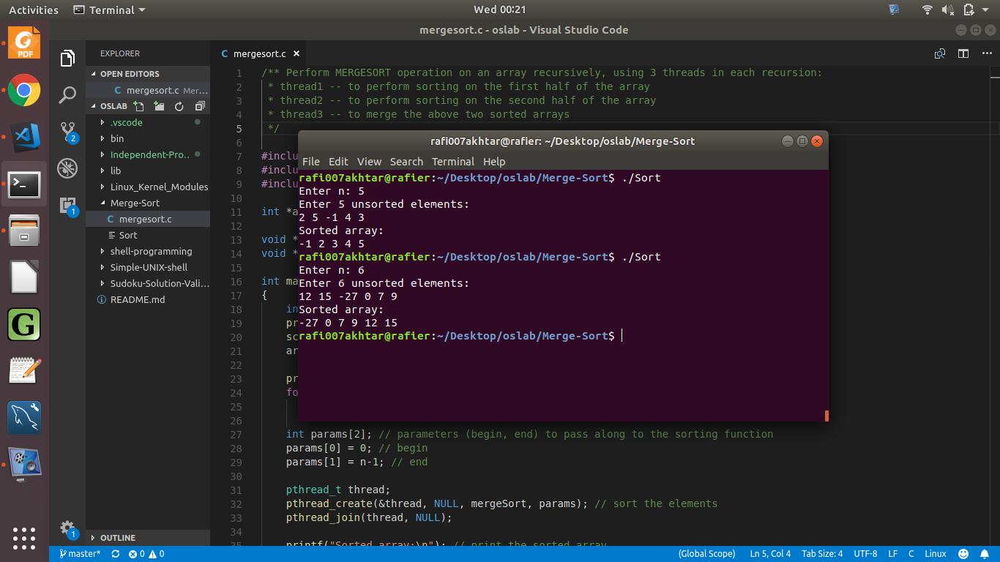

# Merge Sort

This project is inspired from Chapter 4 of _Operating System Concepts._ It is the second and last project of this chapter.

Here, we use multithreading to sort a given array quickly. I have used _three_ threads recursively to accomplish this task.

In each recursion:
1. The first thread will sort the first-half of the array.
2. The second thread will sort the second-half of the array.
3. The thread will merge these two sorted arrays in such a way that the resultant array is sorted.

In a way, this project implements the **merge-sort** algorithm with threads to speed up its runtime. Refer to <a href="https://github.com/rafi007akhtar/oslab/blob/master/Merge-Sort/mergesort.c"> mergesort.c </a> file for source code.

## Instructions

1. Open a terminal and enter the current directory.
	```
	cd Merge-Sort
	```
2. Link and compile the source code.
	```
	gcc mergesort.c -pthread -o Sort
	```
3. Run the executable
	```
	./Sort
	```
4. Enter the value of `n`, which is the number of elements in the array. Follow this by entering the array values.

### Sample Output



## Disclaimer

This project in the book allowed us to pick a sorting algorithm of our own to sort the subarrays; I chose merge-sort due to its low runtime complexity (`O(n lg n)`).

Once again, this solution is not an official one, and the readers are requested to use it only for help, and for solving homework.
