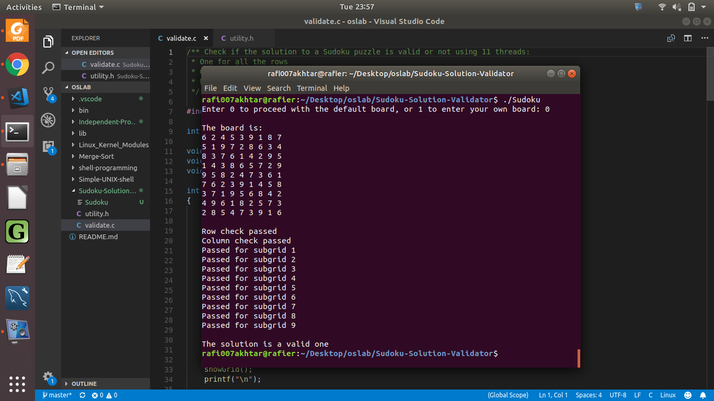

# Sudoku Solution Validator

This project appears in Chapter 4 of _Operating Systems Concepts._ It is the first of the two projects in the said chapter.

**Goal.** Here, we use multithreading to check if a given solution to a Sudoku puzzle is valid or not.

To solve this, I used a total of 11 threads:
<ul>
	<li> one to check each row, </li>
	<li> one to check each column, </li>
	<li> nine for each 3x3 sub-grid.
</ul>

The source code can be found in the <a href="https://github.com/rafi007akhtar/oslab/blob/master/Sudoku-Solution-Validator/validate.c"> validate.c </a> file. I have used some utility functions as well, which are declared and defined in <a href="https://github.com/rafi007akhtar/oslab/blob/master/Sudoku-Solution-Validator/utility.h"> utility.h </a> file.

## Instructions

1. Open a terminal and move to the current directory.
	```
	cd Sudoku-Solution-Validator
	```
2. Link the pthreads module and compile the source code.
	```
	gcc validate.c -pthread -o Sudoku
	```
3. Run the executable.
	```
	./Sudoku
	```
4. If you want to work with the default board given by the program, enter `0`. Otherwise, if you want to work with your own board, enter `1` and then enter your preferred board in a 9x9 square.

### Sample Output

The following image shows a sample output when entered `0` in the executable.



## Disclaimer

As mentioned in the root README, this program is not the official solution to the project. Refer to it if it helps you, but do not use it as a homework solution.
